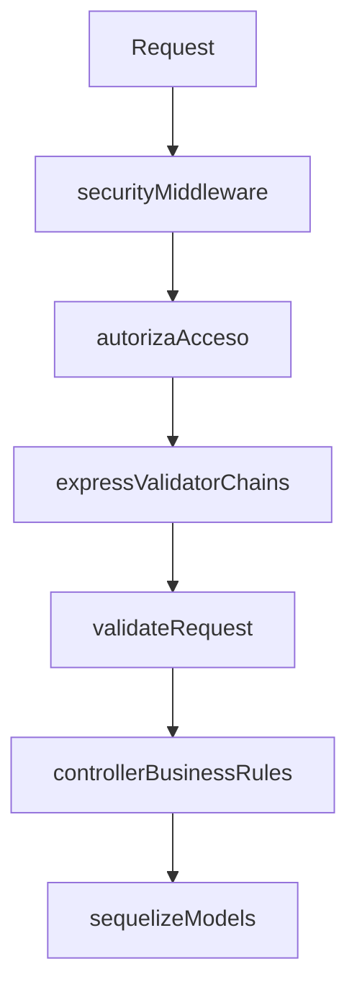

# Plan de migración a express-validator

## Objetivo
Centralizar y uniformar validaciones de entrada en middleware con `express-validator`, manteniendo reglas de negocio en controladores y evitando cambios graves en comportamiento, estatus HTTP y estructura de respuestas.

## Alcance confirmado
Módulos completos:
- `auth`
- `usuarios`
- `encuestas`
- `grupos`
- `matriz`
- `proveedores`

## Estrategia técnica
1. Instalar dependencia y crear una capa común de validación.
2. Crear validadores por dominio/recurso (params, body, query, sanitización).
3. Conectar validadores en rutas (antes del controlador, respetando auth middleware existente).
4. Reducir validación sintáctica duplicada en controladores, conservando validación de negocio (existencia, unicidad, FK, estados, transacciones).
5. Homologar formato de error de validación al contrato actual (`message`, `field/fields`, etc.).
6. Ejecutar pruebas por endpoint y ajuste fino de compatibilidad.

## Flujo propuesto

## Archivos a crear
### Comunes
- [C:/Users/cesar/Documents/Web/amigo-app/amigo-app-backend/middleware/validators/validate-request.js](C:/Users/cesar/Documents/Web/amigo-app/amigo-app-backend/middleware/validators/validate-request.js)
- [C:/Users/cesar/Documents/Web/amigo-app/amigo-app-backend/middleware/validators/common.validators.js](C:/Users/cesar/Documents/Web/amigo-app/amigo-app-backend/middleware/validators/common.validators.js)

### Auth y usuarios
- [C:/Users/cesar/Documents/Web/amigo-app/amigo-app-backend/middleware/validators/auth.validators.js](C:/Users/cesar/Documents/Web/amigo-app/amigo-app-backend/middleware/validators/auth.validators.js)
- [C:/Users/cesar/Documents/Web/amigo-app/amigo-app-backend/middleware/validators/usuarios.validators.js](C:/Users/cesar/Documents/Web/amigo-app/amigo-app-backend/middleware/validators/usuarios.validators.js)
- [C:/Users/cesar/Documents/Web/amigo-app/amigo-app-backend/middleware/validators/catalogos-usuarios.validators.js](C:/Users/cesar/Documents/Web/amigo-app/amigo-app-backend/middleware/validators/catalogos-usuarios.validators.js)
- [C:/Users/cesar/Documents/Web/amigo-app/amigo-app-backend/middleware/validators/registropublico.validators.js](C:/Users/cesar/Documents/Web/amigo-app/amigo-app-backend/middleware/validators/registropublico.validators.js)

### Encuestas y grupos
- [C:/Users/cesar/Documents/Web/amigo-app/amigo-app-backend/middleware/validators/encuestas.validators.js](C:/Users/cesar/Documents/Web/amigo-app/amigo-app-backend/middleware/validators/encuestas.validators.js)
- [C:/Users/cesar/Documents/Web/amigo-app/amigo-app-backend/middleware/validators/grupos.validators.js](C:/Users/cesar/Documents/Web/amigo-app/amigo-app-backend/middleware/validators/grupos.validators.js)

### Matriz y proveedores
- [C:/Users/cesar/Documents/Web/amigo-app/amigo-app-backend/middleware/validators/matriz.validators.js](C:/Users/cesar/Documents/Web/amigo-app/amigo-app-backend/middleware/validators/matriz.validators.js)
- [C:/Users/cesar/Documents/Web/amigo-app/amigo-app-backend/middleware/validators/proveedores.validators.js](C:/Users/cesar/Documents/Web/amigo-app/amigo-app-backend/middleware/validators/proveedores.validators.js)

## Archivos a modificar
### Dependencias/base
- [C:/Users/cesar/Documents/Web/amigo-app/amigo-app-backend/package.json](C:/Users/cesar/Documents/Web/amigo-app/amigo-app-backend/package.json)
- [C:/Users/cesar/Documents/Web/amigo-app/amigo-app-backend/app.js](C:/Users/cesar/Documents/Web/amigo-app/amigo-app-backend/app.js) (solo si se requiere registrar middleware común)
- [C:/Users/cesar/Documents/Web/amigo-app/amigo-app-backend/middleware/error.middleware.js](C:/Users/cesar/Documents/Web/amigo-app/amigo-app-backend/middleware/error.middleware.js) (compatibilidad de formato de error)

### Rutas auth/usuarios
- [C:/Users/cesar/Documents/Web/amigo-app/amigo-app-backend/routes/login/auth.routes.js](C:/Users/cesar/Documents/Web/amigo-app/amigo-app-backend/routes/login/auth.routes.js)
- [C:/Users/cesar/Documents/Web/amigo-app/amigo-app-backend/routes/usuarios/usuarios.routes.js](C:/Users/cesar/Documents/Web/amigo-app/amigo-app-backend/routes/usuarios/usuarios.routes.js)
- [C:/Users/cesar/Documents/Web/amigo-app/amigo-app-backend/routes/usuarios/generos.routes.js](C:/Users/cesar/Documents/Web/amigo-app/amigo-app-backend/routes/usuarios/generos.routes.js)
- [C:/Users/cesar/Documents/Web/amigo-app/amigo-app-backend/routes/usuarios/estados.routes.js](C:/Users/cesar/Documents/Web/amigo-app/amigo-app-backend/routes/usuarios/estados.routes.js)
- [C:/Users/cesar/Documents/Web/amigo-app/amigo-app-backend/routes/usuarios/municipios.routes.js](C:/Users/cesar/Documents/Web/amigo-app/amigo-app-backend/routes/usuarios/municipios.routes.js)
- [C:/Users/cesar/Documents/Web/amigo-app/amigo-app-backend/routes/usuarios/categoriaviviendas.routes.js](C:/Users/cesar/Documents/Web/amigo-app/amigo-app-backend/routes/usuarios/categoriaviviendas.routes.js)
- [C:/Users/cesar/Documents/Web/amigo-app/amigo-app-backend/routes/usuarios/estatusmaritales.routes.js](C:/Users/cesar/Documents/Web/amigo-app/amigo-app-backend/routes/usuarios/estatusmaritales.routes.js)
- [C:/Users/cesar/Documents/Web/amigo-app/amigo-app-backend/routes/usuarios/estatususuarios.routes.js](C:/Users/cesar/Documents/Web/amigo-app/amigo-app-backend/routes/usuarios/estatususuarios.routes.js)
- [C:/Users/cesar/Documents/Web/amigo-app/amigo-app-backend/routes/usuarios/tiposusuarios.routes.js](C:/Users/cesar/Documents/Web/amigo-app/amigo-app-backend/routes/usuarios/tiposusuarios.routes.js)
- [C:/Users/cesar/Documents/Web/amigo-app/amigo-app-backend/routes/usuarios/registropublico.routes.js](C:/Users/cesar/Documents/Web/amigo-app/amigo-app-backend/routes/usuarios/registropublico.routes.js)

### Rutas encuestas (8)
- [C:/Users/cesar/Documents/Web/amigo-app/amigo-app-backend/routes/encuestas/encuestas.routes.js](C:/Users/cesar/Documents/Web/amigo-app/amigo-app-backend/routes/encuestas/encuestas.routes.js)
- [C:/Users/cesar/Documents/Web/amigo-app/amigo-app-backend/routes/encuestas/preguntas.routes.js](C:/Users/cesar/Documents/Web/amigo-app/amigo-app-backend/routes/encuestas/preguntas.routes.js)
- [C:/Users/cesar/Documents/Web/amigo-app/amigo-app-backend/routes/encuestas/respuestas.routes.js](C:/Users/cesar/Documents/Web/amigo-app/amigo-app-backend/routes/encuestas/respuestas.routes.js)
- [C:/Users/cesar/Documents/Web/amigo-app/amigo-app-backend/routes/encuestas/tipoencuestas.routes.js](C:/Users/cesar/Documents/Web/amigo-app/amigo-app-backend/routes/encuestas/tipoencuestas.routes.js)
- [C:/Users/cesar/Documents/Web/amigo-app/amigo-app-backend/routes/encuestas/usuariosencuestas.routes.js](C:/Users/cesar/Documents/Web/amigo-app/amigo-app-backend/routes/encuestas/usuariosencuestas.routes.js)
- [C:/Users/cesar/Documents/Web/amigo-app/amigo-app-backend/routes/encuestas/detalleusuariosencuestas.routes.js](C:/Users/cesar/Documents/Web/amigo-app/amigo-app-backend/routes/encuestas/detalleusuariosencuestas.routes.js)
- [C:/Users/cesar/Documents/Web/amigo-app/amigo-app-backend/routes/encuestas/encuestaspreguntasrespuestas.routes.js](C:/Users/cesar/Documents/Web/amigo-app/amigo-app-backend/routes/encuestas/encuestaspreguntasrespuestas.routes.js)
- [C:/Users/cesar/Documents/Web/amigo-app/amigo-app-backend/routes/encuestas/interpretacionresultados.routes.js](C:/Users/cesar/Documents/Web/amigo-app/amigo-app-backend/routes/encuestas/interpretacionresultados.routes.js)

### Rutas grupos (7)
- [C:/Users/cesar/Documents/Web/amigo-app/amigo-app-backend/routes/grupos/grupos.routes.js](C:/Users/cesar/Documents/Web/amigo-app/amigo-app-backend/routes/grupos/grupos.routes.js)
- [C:/Users/cesar/Documents/Web/amigo-app/amigo-app-backend/routes/grupos/tiposgrupos.routes.js](C:/Users/cesar/Documents/Web/amigo-app/amigo-app-backend/routes/grupos/tiposgrupos.routes.js)
- [C:/Users/cesar/Documents/Web/amigo-app/amigo-app-backend/routes/grupos/estatusgrupos.routes.js](C:/Users/cesar/Documents/Web/amigo-app/amigo-app-backend/routes/grupos/estatusgrupos.routes.js)
- [C:/Users/cesar/Documents/Web/amigo-app/amigo-app-backend/routes/grupos/periodos.routes.js](C:/Users/cesar/Documents/Web/amigo-app/amigo-app-backend/routes/grupos/periodos.routes.js)
- [C:/Users/cesar/Documents/Web/amigo-app/amigo-app-backend/routes/grupos/periodosgrupos.routes.js](C:/Users/cesar/Documents/Web/amigo-app/amigo-app-backend/routes/grupos/periodosgrupos.routes.js)
- [C:/Users/cesar/Documents/Web/amigo-app/amigo-app-backend/routes/grupos/inscripcionesgrupos.routes.js](C:/Users/cesar/Documents/Web/amigo-app/amigo-app-backend/routes/grupos/inscripcionesgrupos.routes.js)
- [C:/Users/cesar/Documents/Web/amigo-app/amigo-app-backend/routes/grupos/asistencia.routes.js](C:/Users/cesar/Documents/Web/amigo-app/amigo-app-backend/routes/grupos/asistencia.routes.js)

### Rutas matriz/proveedores (7)
- [C:/Users/cesar/Documents/Web/amigo-app/amigo-app-backend/routes/matriz/matrizacceso.routes.js](C:/Users/cesar/Documents/Web/amigo-app/amigo-app-backend/routes/matriz/matrizacceso.routes.js)
- [C:/Users/cesar/Documents/Web/amigo-app/amigo-app-backend/routes/matriz/vistas.routes.js](C:/Users/cesar/Documents/Web/amigo-app/amigo-app-backend/routes/matriz/vistas.routes.js)
- [C:/Users/cesar/Documents/Web/amigo-app/amigo-app-backend/routes/proveedores/estatuspublicaciones.routes.js](C:/Users/cesar/Documents/Web/amigo-app/amigo-app-backend/routes/proveedores/estatuspublicaciones.routes.js)
- [C:/Users/cesar/Documents/Web/amigo-app/amigo-app-backend/routes/proveedores/tiposserviciosproveedores.routes.js](C:/Users/cesar/Documents/Web/amigo-app/amigo-app-backend/routes/proveedores/tiposserviciosproveedores.routes.js)
- [C:/Users/cesar/Documents/Web/amigo-app/amigo-app-backend/routes/proveedores/serviciosproveedores.routes.js](C:/Users/cesar/Documents/Web/amigo-app/amigo-app-backend/routes/proveedores/serviciosproveedores.routes.js)
- [C:/Users/cesar/Documents/Web/amigo-app/amigo-app-backend/routes/proveedores/proveedoresconservicios.routes.js](C:/Users/cesar/Documents/Web/amigo-app/amigo-app-backend/routes/proveedores/proveedoresconservicios.routes.js)
- [C:/Users/cesar/Documents/Web/amigo-app/amigo-app-backend/routes/proveedores/publicaciones.routes.js](C:/Users/cesar/Documents/Web/amigo-app/amigo-app-backend/routes/proveedores/publicaciones.routes.js)

### Controladores con ajuste mínimo (solo retirar duplicación)
- `controllers/login/auth.controller.js`
- `controllers/usuarios/usuarios.controller.js`
- `controllers/usuarios/registropublico.controller.js`
- 8 controladores de `controllers/encuestas/*.controller.js`
- 7 controladores de `controllers/grupos/*.controller.js`
- 2 controladores de `controllers/matriz/*.controller.js`
- 5 controladores de `controllers/proveedores/*.controller.js`

## Estimación de impacto de archivos
- **Nuevos**: 10 archivos.
- **Modificados (mínimo viable)**: 35 archivos (34 rutas + `package.json`).
- **Modificados (recomendado uniforme)**: 58–61 archivos (35 base + 23–26 controladores + opcional `app.js` y `error.middleware.js`).

## Criterios de uniformidad y no regresión
- Mantener el orden de middlewares de seguridad/autorización existentes.
- Mantener los mismos códigos HTTP y estructura de respuesta en errores esperados.
- No mover reglas de negocio/DB a validadores (solo validación de entrada).
- Reutilizar lógica existente de formato/longitud cuando aplica (`helpers/usuario-registro-payload.js`).
- Validar `PUT` vs `PATCH` con semántica actual (total vs parcial).

## Fases de ejecución
1. **Infraestructura base** (`express-validator` + middleware común de resultado).
2. **Auth + Usuarios** (incluye registro público y catálogos de usuario).
3. **Encuestas**.
4. **Grupos**.
5. **Matriz + Proveedores**.
6. **Homologación final de errores y limpieza de validaciones duplicadas en controllers**.

## Validación de salida
- Prueba smoke por endpoint CRUD (GET/GET:id/POST/PUT/PATCH/DELETE).
- Casos negativos por módulo (params inválidos, body incompleto, tipos incorrectos).
- Verificación de no cambio de comportamiento en reglas de negocio (duplicados, FK, estados, sesión/JWT).
- Comparación de payload de error antes/después en endpoints críticos (`auth`, `registropublico`, `publicaciones`, `inscripcionesgrupos`).